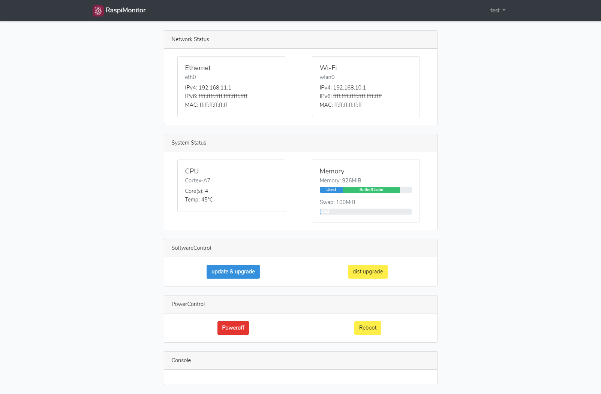

 

## About RaspiMonitor

RaspberryPiの情報をブラウザで見れるようにするやつ。

## features

- NICの情報の表示
  - IPv4 Address
  - IPv6 Address
  - MAC Address
- サービスの情報の表示
  - Description
  - Active-State
- CPU情報の表示
  - Core数
  - CPU温度
  - 現在のクロック（実装予定）
- メモリ情報の表示
  - Used, Buffers/Cached の量のグラフ表示
  - SwapのUsed の量のグラフ表示
- ディスク情報の表示
  - Usedの量のグラフ表示
  - Totalの量の表示
- RaspberryPiのシャットダウン / 再起動

## License

The RaspiMonitor is open-source software licensed under the [MIT license](https://opensource.org/licenses/MIT).
